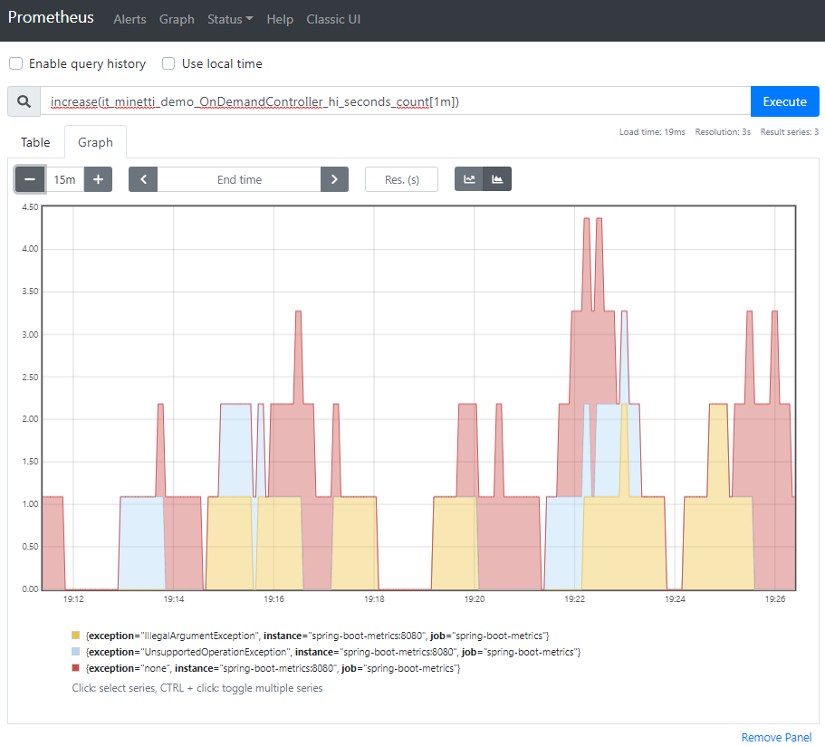
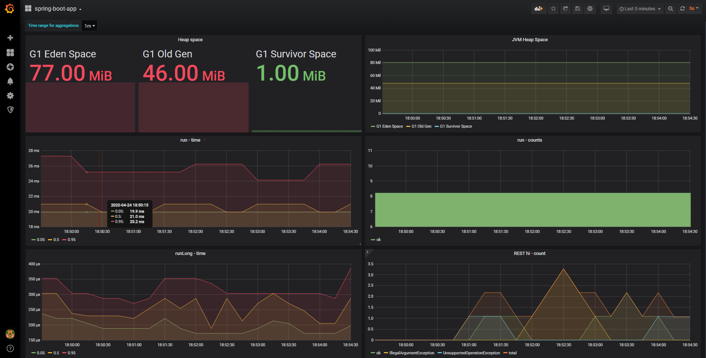

# Metrics for spring-boot application

### Goal

The purpose of this project is to find an elegant way to **metric** and **log** the duration of pieces of the code using the cross-cutting support of AOP.

### Project structure

The project is divided in three components:
1. the Java spring-boot application that generate and expose the metrics
2. *prometheus*, an open-source systems monitoring and alerting toolkit that includes built-in and active scraping, storing, querying, graphing, and alerting based on multi-dimensional time series data
3. *Grafana*, the open-source analytics and monitoring solution that allow to create several dashboard and alerts using data from several sources including prometheus

All the components can be instantiated on the docker containers with no need of interaction with external services.

### Prerequisites

The Java project compiles with `Java 11` using `maven`. To fully experiment and enjoy the project is required to use `Docker` to run the three services in the containers.

### Idea and implementation

In the Java sources, the `RandomSumService` class contains two methods, both sum several random `BigInteger` pretending to be a business cpu-consuming algorithms. As you can see the `runClassic()` uses a widespread and simple way to calculate the time spent of a piece of code by surrounding logs and calls to `System.currentTimeMillis()`. The method `run()` instead has no explicit logic for the timing in its body. It is, instead, annotated with a custom annotation. This annotation is defined in the package `aop` and it is used to apply a specific aspect. This aspect works "around" the method, or generally join-point, it retrieve the specific logger of the class and it prints some useful information like the start and the stop of the method and the time spent; it produces a result very similar to the previous method but this time the business logic is not filled by technical instructions to metrics the spent time or to log it.

Every method can be enriched in this way just adding the custom annotation. More over the aspect is implicitly applied also to every public method of any class annotated by `@RestContoller`, this rule works combining several pointcut annotations that you can find in the aspect class.

In the project, a scheduled job is present to automatically create metrics, and several rest end-point can be invoked manually to have more metrics.

### Technologies for the Java component

The Java part of the project uses `Spring framework` with `spring-boot` that is de-facto standard for microservices architecture in Java. The custom annotation works thanks to `Aspectj` weaving support that enables some nice features for aspect oriented programming. All the metrics of the application are exposed via `jmx` protocol and `prometheus` http end-point; despite the `jmx` interface is not really used in this project, it is effortless and comes with `spring-boot-actuator` and the `micrometer` dependencies. For unit testing you can find the very common `JUnit5`, `hamcrest` and `Mockito`. For the performance test `jmh` is a wonderful tool also included in the openjdk 12. There are two optional maven plugin to quickly manage the docker images and instance. The `com.spotify:dockerfile-maven-plugin` allows to easily builds an image that contains the executable spring-boot application and it is included in the maven `install` goal; `docker-compose-maven-plugin` runs the `docker-compose` to setup and launch the three components but it is not bound to any maven goal.

### How to run

* You can `mvn clean compile spring-boot:run` to compile and run the Java application.

* With `mvn clean package` you create the jar (executable for the \*nix systems) and build the spring-boot-app docker image.

* You can compile, run and stop the three components using, respectively, `docker-compose build`, `docker-compose up` and `docker-compose stop`. Or you can rely on maven using `mvn docker-compose:build`, `mvn docker-compose:up` and `mvn docker-compose:stop`.

> :warning: **before building the main Dockerfile**: Be very careful to have the spring-boot-metrics.jar in the target directory, this file is needed to create the docker image.

Tip: during my experiments I found very useful this command

    docker-compose down && docker-compose up --build -d

### Useful links for testing the containers

Depending on your docker-machine and docker-host you may need to vary the url of the following urls.

    DOCKER_IP=192.168.99.100                  # this is my configuration
    # the spring-boot application
    curl $DOCKER_IP:8080/actuator/prometheus  # feed for prometheus
    curl $DOCKER_IP:8080/run                  # launch the run() method
    curl $DOCKER_IP:8080/hello                # returns a static text
    curl $DOCKER_IP:8080/hi                   # randomly return 200 or 500

The prometheus instance is running here: http://$DOCKER_IP:9090

Grafana instance is running here: http://$DOCKER_IP:3000 , the default login is user `admin` and password `admin`

### Prometheus

Prometheus allow to setup the scraping configurations and the targets with a simple yaml file.

Here the screenshot of graph in prometheus:

### Grafana

Grafana has an interesting feature to prevision some the datasources and the dashboard, this enables to find the prepared dashboard on the web gui without any additional effort. For mode details check the Dockerfile and the grafana.ini file.

Here the screenshot of the main dashboard preconfigured:

### Credits and useful links

* Micrometer with Spring https://spring.io/blog/2018/03/16/micrometer-spring-boot-2-s-new-application-metrics-collector
* Java Microbenchmark Harness by openjdk https://openjdk.java.net/projects/code-tools/jmh/
* Aspectj https://www.eclipse.org/aspectj/
* Prometheus on Docker https://prometheus.io/docs/prometheus/latest/installation/
* Grafana on Docker https://grafana.com/docs/grafana/latest/installation/docker/
* Samples for Grafana provisioning https://github.com/cirocosta/sample-grafana
* docker-compose https://docs.docker.com/compose/
